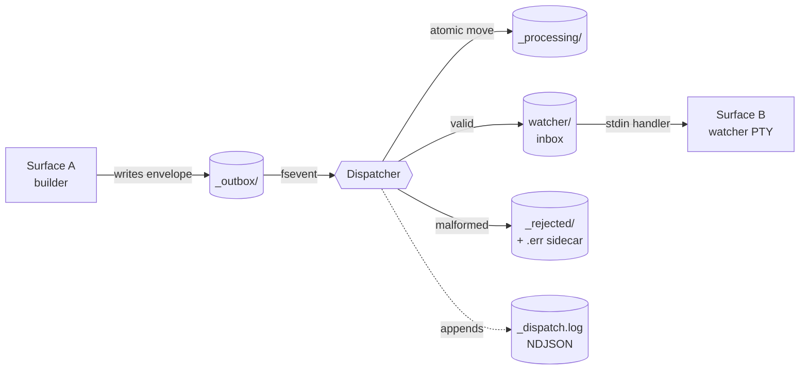
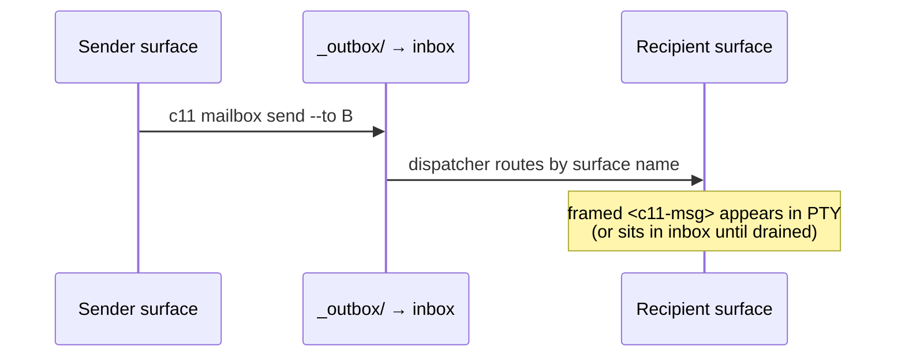
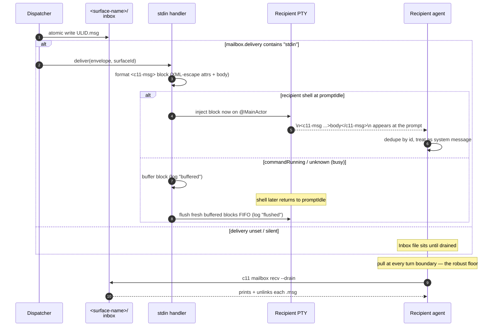
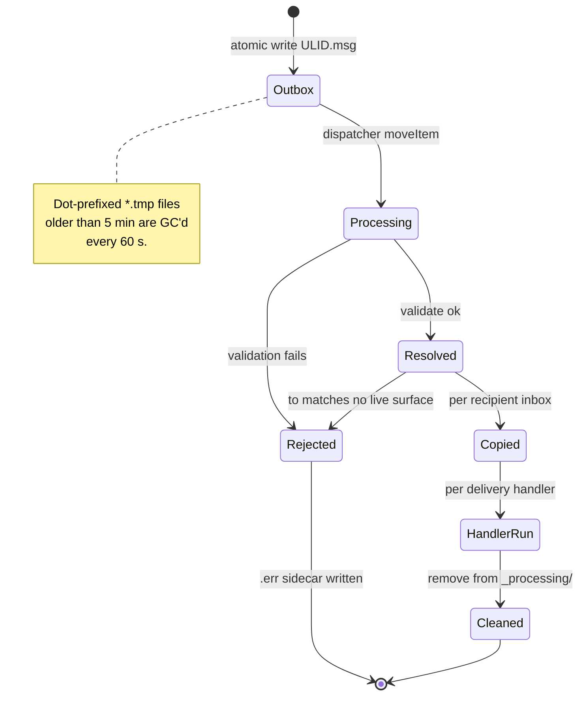
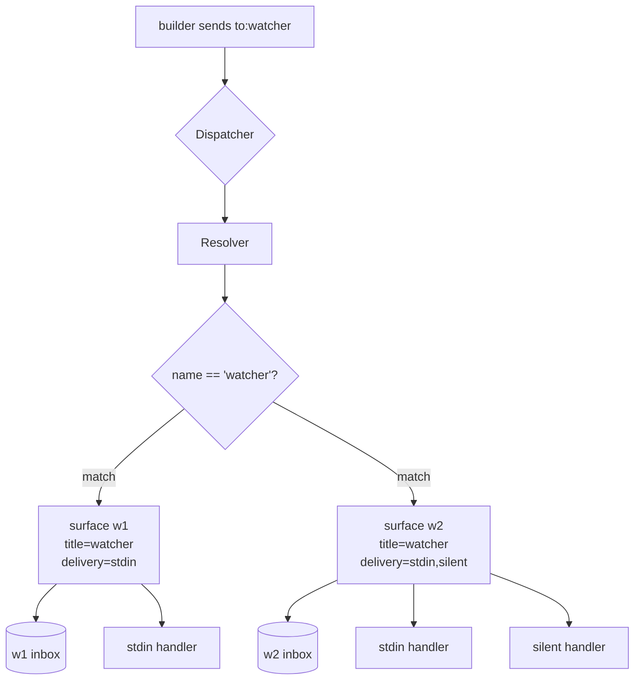
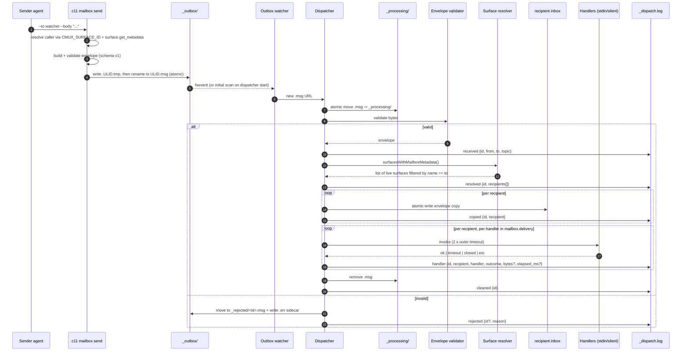

# c11 Mailbox: Agent-to-Agent Messaging Guide

The c11 mailbox is the in-workspace message board agents use to coordinate. One agent writes a small JSON envelope to a shared outbox; the dispatcher routes it by surface name, drops a copy into the recipient's inbox, and (when configured) injects a framed `<c11-msg>` block straight into the recipient's PTY.

This is the practical guide. For the agent-facing quick-reference see the "Inter-agent messaging (mailbox)" section of `skills/c11/SKILL.md`. For the architectural rationale and v1 design discussion see `docs/c11-messaging-primitive-design.md`. For the wire schema see `spec/mailbox-envelope.v1.schema.json`.

> **Stage 2 status.** Everything in this document describes what ships today. Topic fan-out, the `watch` handler, `_processing/` crash recovery, and per-surface inbox caps are deferred to Stage 3 and called out explicitly where they would otherwise mislead you.

---

## What it is

A per-workspace tree under `~/Library/Application Support/c11/workspaces/<workspace-uuid>/mailboxes/` that holds the outbox, per-recipient inboxes, an append-only dispatch log, and quarantine/processing scratch areas. The c11 process running the workspace owns one `MailboxDispatcher` that watches the outbox and routes whatever shows up.

Recipients can live in **any** workspace, not just the sender's. `c11 mailbox send` resolves the recipient name across every live workspace in the instance and writes the envelope into the recipient workspace's own outbox, so that workspace's dispatcher delivers it locally (see [Cross-workspace routing](#cross-workspace-routing)).



Two facts to internalize:

1. **The filesystem is the contract.** The CLI is convenience over file I/O. Any process that can write a JSON file to a directory can send a message; any process that can list a directory can receive one. The `tests_v2/test_mailbox_parity.py` test asserts CLI sends and raw file writes produce byte-identical envelopes.
2. **A surface is addressed by a stable handle, falling back to its name.** The resolver matches `to` with precedence **address → role → title** (see [Addressing](#addressing-stable-handles-and-the-title-fallback) below). A surface is addressable as long as it has a `title` (set with `c11 set-title` / `c11 rename-tab`); the optional `mailbox.address` / `mailbox.role` keys give it a rename-proof handle on top.

---

## When to reach for it

Use the mailbox when:

- The operator asks you to coordinate with, hand off to, or notify another pane ("tell the watcher pane the build is green", "ask the reviewer agent to look at PR 73").
- A sibling agent needs to act and you are not the right surface to do the work.
- You want to leave a durable note for a pane that may not be reading right now. The envelope sits in the recipient's inbox until they drain it.
- Two or more agents need to converge on a result and you want the exchange to be inspectable later (`_dispatch.log` is your audit trail).

Do **not** reach for the mailbox when:

- You and the recipient are the same surface. Just do the work.
- You need a tight request/response loop measured in milliseconds. The dispatcher is at-least-once, not low-latency.
- The payload is large. Inline `body` is capped at 4096 UTF-8 bytes; for anything bigger, use `body_ref` with an absolute path the recipient can read.
- You need fan-out by topic. Stage 2 does not deliver topic-only envelopes.

---

## Quick start

```bash
# In surface "builder":
c11 set-title "builder"
c11 mailbox send --to watcher --body "build green sha=abc"

# In surface "watcher":
c11 set-title "watcher"
c11 set-metadata mailbox.delivery stdin   # opt in to PTY injection
# The framed block lands in the PTY the next time builder sends — at a shell
# prompt it injects immediately; if watcher is mid-command it buffers and
# flushes at the next prompt (see "Prompt-gated delivery" below).
c11 mailbox recv --drain                   # robust floor: pull at turn boundaries
```

If `mailbox.delivery` is not set on the recipient, the envelope still lands in `<surface-name>/` inbox; the recipient drains it explicitly with `c11 mailbox recv`. Even with `stdin` set, draining at turn boundaries is the reliable delivery path — push is prompt-gated and best-effort.

---

## Addressing: stable handles and the title fallback

A `--to` value resolves against three per-surface keys, in precedence order:

| Precedence | Key | Set by | Notes |
|-----------|-----|--------|-------|
| 1 | `mailbox.address` | the surface, once at orientation | Stable, rename-proof handle. Survives every later `set-title` / `rename-tab`. |
| 2 | `mailbox.role` | the surface, opt-in | Reach a surface by function (`delegator`, `orchestrator`). Only `mailbox.role` is consulted — the canonical `role` key is not. |
| 3 | `title` | `set-title` / `rename-tab` | Display name. The fallback, so a bare-name send keeps working for surfaces that declare no stable identity. |

**Why this exists.** The title is mutable, and the c11 orientation convention has every agent rename its tab as its first action. If peers address each other by title, the bus silently re-partitions the moment anyone renames. Declaring a `mailbox.address` at orientation gives a surface an identity that does not move when its display name does.

```bash
# Recipient, once at orientation:
c11 set-metadata --surface "$C11_SURFACE_ID" --key mailbox.address --value "delegator-c11-143" --type string
c11 set-metadata --surface "$C11_SURFACE_ID" --key mailbox.role    --value "delegator"         --type string  # optional
```

**Bare name vs qualifier forms.** A bare `--to <x>` walks the precedence chain (address, then role, then title). To target a specific key unambiguously — never falling back to the title — use a qualifier form:

```bash
c11 mailbox send --to surface:delegator-c11-143 --body "…"   # matches mailbox.address ONLY
c11 mailbox send --to role:delegator            --body "…"   # matches mailbox.role ONLY
c11 mailbox send --to watcher                   --body "…"   # bare: address → role → title
```

These `surface:` / `role:` forms select *which surfaces* match; the workspace `--to-workspace` qualifier (below) is an orthogonal axis selecting *which workspace*. The envelope's `to` field stays an opaque string — no schema change — so the framed block a recipient sees carries whatever handle the sender used.

`surface:` and `role:` are **reserved leading tokens** in `--to`: a value beginning with either is always parsed as that qualifier, never as a title. So a surface whose title literally starts with `surface:` or `role:` is not reachable by a bare `--to` (address it by its `mailbox.address`/`mailbox.role` instead). Any other colon stays part of a bare name — `--to ci:status` is a plain name.

**Back-compat.** A surface with only a `title` is addressable by that title exactly as before. `mailbox.address` / `mailbox.role` are additive; the inbox directory is still keyed on the recipient's title.

---

## Send flow



Under the hood the dispatcher validates the envelope against schema v1, resolves the recipient by the address → role → title precedence (see [Addressing](#addressing-stable-handles-and-the-title-fallback)), copies into the recipient's inbox, and runs each registered delivery handler. Every state transition appends to `_dispatch.log` (NDJSON). Malformed envelopes land in `_rejected/` with a `.err` sidecar describing what failed. See [Internals: full send sequence](#internals-full-send-sequence) at the bottom for the complete step-by-step.

### Two equivalent send paths

Both must produce byte-identical JSON. The parity test enforces this.

**CLI (recommended for agents):**

```bash
c11 mailbox send --to watcher --body "build green sha=abc"
c11 mailbox send --to watcher --topic ci.status --urgent --body "CI red" \
  --reply-to builder --in-reply-to 01K3A2B7X8PQRTVWYZ0123456J
```

Auto-fills `version`, `id` (fresh ULID), `ts` (current UTC), and `from` (the caller's surface title resolved over the socket). Prints the new envelope id on stdout.

Send flags accepted by the CLI:

| Flag                  | Purpose                                                            |
|-----------------------|--------------------------------------------------------------------|
| `--to <surface>`      | Recipient handle, in any workspace. Bare name resolves address → role → title; `surface:<addr>` / `role:<name>` target one key. Required in Stage 2 (topic-only rejected). |
| `--to-workspace <ref>`| Disambiguate a name that exists in more than one workspace. A workspace UUID or `workspace:*` ref. |
| `--topic <token>`     | Dotted topic. Stored on the envelope; not used for routing yet.    |
| `--body <text>`       | Inline body, ≤ 4096 bytes UTF-8.                                   |
| `--body-ref <path>`   | Absolute path to an external body. `--body` must be empty.         |
| `--reply-to <surface>`| Surface that should receive the reply.                             |
| `--in-reply-to <id>`  | ULID of the envelope being answered.                               |
| `--urgent`            | Sender hint. Handlers may honor or ignore.                         |
| `--ttl-seconds <n>`   | Advisory expiry. Recipients may drop expired envelopes on read.    |
| `--from <surface>`    | Override caller's resolved title.                                  |
| `--id <ulid>`         | Pin envelope id (testing / replay).                                |
| `--ts <rfc3339>`      | Pin timestamp (testing / replay).                                  |
| `--content-type <m>`  | MIME hint for body or body_ref.                                    |

**Raw file write (any process, any language):**

```bash
OUTBOX=$(c11 mailbox outbox-dir)
MY_NAME=$(c11 mailbox surface-name)
ULID=$(c11 mailbox new-id)
cat > "$OUTBOX/.$ULID.tmp" <<EOF
{"version":1,"id":"$ULID","from":"$MY_NAME","to":"watcher","ts":"$(date -u +%FT%TZ)","body":"build green sha=abc"}
EOF
mv "$OUTBOX/.$ULID.tmp" "$OUTBOX/$ULID.msg"
```

The dispatcher only sees files that match `*.msg` and do not start with `.`. Always write to a dot-prefixed `.tmp` sibling first and rename. A canonical reference lives at `Resources/bin/c11-mailbox-send-bash-example.sh`.

> **Raw writers are workspace-local.** `outbox-dir` prints *your own* workspace's outbox, and a dispatcher only resolves names within its own workspace. So a raw file write reaches only recipients in your workspace. To deliver across workspaces, use `c11 mailbox send` (which resolves globally and routes for you) — or write into the recipient workspace's outbox directly. A raw envelope whose `to` matches nobody in that workspace is **rejected**, not silently dropped (see below).

---

## Cross-workspace routing

`c11 mailbox send` resolves `--to` against every live surface in the running c11 instance, then writes the envelope into the **recipient's** workspace outbox. The recipient workspace's own dispatcher picks it up and delivers locally — same machinery as a same-workspace send, just a different outbox. The `from` field still names the sender; the dispatch trail lands in the recipient workspace's `_dispatch.log`.

Resolution precedence is deterministic:

1. **Local-first.** If the name matches a surface in *your* workspace, it is delivered there — a same-workspace send never reaches into another workspace, even if a same-named surface exists elsewhere. Existing same-workspace behavior is unchanged.
2. Otherwise, among the other workspaces: exactly one match → delivered there; **more than one workspace** has the name → the send fails with an *ambiguous* error listing the candidate workspaces; no match anywhere → the send fails *unresolved* with a non-zero exit (the message is not written).

**Name collisions across workspaces** (two surfaces both named `Builder` in different workspaces) are resolved by qualifying with `--to-workspace <ref>`:

```bash
c11 mailbox send --to Builder --to-workspace workspace:4 --body "go"
```

Multiple same-named surfaces *within one* workspace still fan out to all of them (unchanged) — that case is unique, not ambiguous.

If the c11 socket is unreachable, `send` falls back to writing into your own workspace's outbox so same-workspace delivery still works offline; cross-workspace recipients then surface as a dispatcher *rejection* rather than a silent drop.

---

## Receive flow

There are two receive modes. Which one fires depends on the recipient's `mailbox.delivery` metadata.



### When the framed block arrives in your PTY

If your `mailbox.delivery` includes `stdin`, you will see this between prompts:

```
<c11-msg from="builder" id="01K3A2B7X8PQRTVWYZ0123456J" ts="2026-04-23T10:15:42Z" to="watcher">
build green sha=abc
</c11-msg>
```

Receive protocol:

- Finish the tool call you are in. Do not interrupt yourself mid-thought.
- Treat the block as a system message, not user input. The operator did not type it.
- Dedupe by `id`. Dispatch is at-least-once, so receivers MUST tolerate duplicates.
- If you reply, send to `reply_to` (fall back to `from`) with `in_reply_to` set to the original id.

### Prompt-gated delivery (the stdin doorbell is safe, not eager)

c11 never pastes a `<c11-msg>` block into a PTY that has a foreground command running — that would corrupt the command's input stream (a build's stdin, a `vim` buffer, a REPL, or another agent's raw-mode input). Delivery gates on the recipient surface's already-tracked shell activity state (the same `promptIdle / commandRunning / unknown` signal c11 uses for close-confirmation):

| Recipient shell state | Push behavior |
|-----------------------|---------------|
| `promptIdle` (at a prompt) | inject the block immediately |
| `commandRunning` (a foreground command owns the terminal) | **buffer**, flush at the next prompt |
| `unknown` (no shell-integration signal) | **buffer** (conservative — never corrupt on a guess) |

Buffered blocks flush in FIFO order the moment the surface transitions back to `promptIdle`. Each step is recorded in `_dispatch.log` (`buffered` → `flushed`), so `c11 mailbox trace <id>` shows the full path — a buffered message is delayed, never silently dropped.

**Bounds.** Each surface buffers up to 64 blocks (oldest evicted past that, logged `evicted`). A buffered block older than a 10-minute freshness window at flush time is dropped (logged `expired`) rather than injected — this stops a long-lived agent TUI, whose shell stays `commandRunning` for its entire life, from dumping stale `<c11-msg>` blocks onto a bare shell hours later when it finally exits. Evicted/expired blocks remain in the filesystem inbox; `recv --drain` is their floor.

**Why you still pull.** Because a live agent keeps its shell `commandRunning`, stdin push into a busy agent typically buffers and may never flush in time. The filesystem inbox copy is written *before* any push is attempted, so `c11 mailbox recv --drain` at every turn boundary is the delivery path that always works. Treat stdin push as a best-effort doorbell; treat the pull cadence as the contract.

### Explicit inbox drain

```bash
c11 mailbox recv --drain    # default: list, print, unlink
c11 mailbox recv --peek     # list + print only, leave files in place
c11 mailbox recv --surface watcher --drain   # drain on someone else's behalf
```

Files are sorted lexicographically by ULID, which gives you near-chronological order across a single sender.

### Exact PTY frame shape

The stdin handler emits attributes in a fixed order so tests can pin the byte form. Order: `from`, `id`, `ts`, `to`, `topic`, `reply_to`, `in_reply_to`, `urgent`, `ttl_seconds`. Optional attributes are omitted when unset.

| Layer            | Escaped characters    |
|------------------|-----------------------|
| Attribute values | `<`, `>`, `&`, `"`    |
| Body text        | `<`, `>`, `&`         |

A literal `</c11-msg>` in the body cannot forge a closing tag because `<` is escaped on write.

---

## Envelope lifecycle



The `received → resolved → copied → handler → cleaned` sequence shows up as discrete NDJSON lines in `_dispatch.log`. The `rejected` branch is the alternate terminal state and writes a `<id>.err` sibling explaining what failed. A well-formed envelope whose `to` resolves to **no live surface** in the dispatching workspace takes the `rejected` branch too (reason: `no live surface named '<to>' …`) — an undeliverable message is quarantined with its sidecar, never silently cleaned.

---

## Multi-recipient fan-out

Stage 2 fan-out happens two ways. **Topic-driven fan-out is not one of them.**

### 1. Multiple handlers per recipient

`mailbox.delivery` is a comma-separated list. The dispatcher invokes each handler in order on the same envelope.

```bash
c11 set-metadata mailbox.delivery stdin,silent
```

`stdin` injects the framed block into the PTY; `silent` is a no-op that just records `ok` in the dispatch log. The handler set registered in production is exactly `{stdin, silent}`. Anything else logged as `eio` with reason "unknown handler".

### 2. Multiple surfaces sharing the same name

If two live surfaces both have `title = "watcher"`, the resolver returns both. The dispatcher copies the envelope into each surface's inbox and runs each surface's handler chain.



Same-name fan-out is tolerated rather than designed-for. The resolver's doc comment notes "in practice 0 or 1; we tolerate duplicates by returning a list." Use it deliberately if you want broadcast to a named pool, and expect ordering across the recipients to be unspecified.

### Topic fan-out (Stage 3)

`c11 mailbox send --topic ci.status` without `--to` is **rejected at the CLI** with `topics_not_implemented`. A topic-only envelope written via raw file would be accepted by the validator but resolve to zero recipients (the `resolved` log line records an empty list). Always pair `--topic` with `--to <surface>` until Stage 3 wires `mailbox.subscribe` globs into the resolver.

---

## Envelope schema (v1, locked)

| Field          | Type    | Required | Constraint                                                    |
|----------------|---------|----------|---------------------------------------------------------------|
| `version`      | integer | yes      | Must be `1` (literal integer, not string).                    |
| `id`           | string  | yes      | Crockford base32 ULID, 26 chars (no I/L/O/U).                 |
| `from`         | string  | yes      | Sender surface name. Non-empty, ≤ 256 bytes.                  |
| `ts`           | string  | yes      | RFC3339 UTC with `Z` suffix. Sender-attested, NOT ordering.   |
| `body`         | string  | yes      | UTF-8 ≤ 4096 bytes. Must be `""` when `body_ref` is set.      |
| `to`           | string  | one of   | Recipient surface name. ≤ 256 bytes.                          |
| `topic`        | string  | one of   | Dotted token `^[A-Za-z0-9_][A-Za-z0-9_.\-]*$`. ≤ 256 bytes.   |
| `reply_to`     | string  | no       | Surface name to reply to. Non-empty, ≤ 256 bytes.             |
| `in_reply_to`  | string  | no       | ULID of the envelope being replied to.                        |
| `urgent`       | boolean | no       | Sender hint.                                                  |
| `ttl_seconds`  | integer | no       | ≥ 1. Advisory; recipients may drop expired envelopes on read. |
| `body_ref`     | string  | no       | Absolute path (must start with `/`).                          |
| `content_type` | string  | no       | MIME hint, ≤ 128 bytes.                                       |
| `ext`          | object  | no       | Forward-compat escape hatch. Any keys allowed under `ext`.    |

`additionalProperties: false` at the top level. Any unknown key triggers `unknownTopLevelKey` rejection. Use `ext` for forward-compat experimentation.

---

## Dispatch log: `_dispatch.log`

Newline-delimited JSON, one event per line, append-only. Every event carries an ISO8601 UTC `ts` (with fractional seconds) plus the fields listed below.

| Event       | Fields                                                              |
|-------------|---------------------------------------------------------------------|
| `received`  | `id`, `from`, `to?`, `topic?`                                       |
| `resolved`  | `id`, `recipients[]` (surface names; can be empty)                  |
| `copied`    | `id`, `recipient`                                                   |
| `handler`   | `id`, `recipient`, `handler`, `outcome`, `bytes?`, `elapsed_ms?`    |
| `rejected`  | `id?`, `reason`                                                     |
| `cleaned`   | `id`                                                                |
| `gc`        | `temp_files_removed`                                                |
| `replayed`  | `id` (declared in the event enum; not emitted in Stage 2)           |

Handler outcomes: `ok`, `timeout`, `eio`, `closed`, plus the C11-144 stdin delivery-safety lifecycle `buffered`, `flushed`, `expired`, `evicted` (all emitted as `handler` events with `handler = "stdin"`, so a buffered message's full path is traceable). (`epipe` was declared in early drafts and removed in P0 #6 because nothing emits it.) `timeout` is a reporting bound, not a runtime cancellation: the dispatcher logs after 2 s and moves on, but the handler closure may still be running.

| stdin outcome | Meaning |
|---------------|---------|
| `buffered`    | recipient shell was busy; block queued to flush at the next prompt |
| `flushed`     | a previously-buffered block was injected once the shell went idle |
| `expired`     | a buffered block aged past the freshness window; dropped (inbox floor holds it) |
| `evicted`     | a buffered block dropped because the per-surface cap was exceeded (inbox floor holds it) |

```bash
c11 mailbox tail                              # follow log as it grows
c11 mailbox trace 01K3A2B7X8PQRTVWYZ0123456J  # filter for one envelope id
```

---

## Patterns

### Request / reply

```bash
# builder
REQ_ID=$(c11 mailbox send --to reviewer --body "review sha=abc")

# reviewer (after work)
c11 mailbox send --to builder --in-reply-to "$REQ_ID" --body "lgtm"
```

Setting `--reply-to` is only necessary when the reply should land somewhere other than the original sender's surface.

### Durable handoff

A surface that may not exist yet still gets its inbox created on first delivery. Send to `archivist`; when an archivist surface is later created with `title = archivist`, it can drain the queued envelopes:

```bash
c11 mailbox recv --drain
```

Inboxes survive c11 restarts; envelopes sitting in the outbox at restart are picked up by the dispatcher's initial scan.

### Fire-and-forget notification

Set the recipient's `mailbox.delivery` to `silent` if you want a logged delivery without PTY noise. The envelope is copied to the inbox and the silent handler logs `ok`. Useful for status broadcasts where the recipient polls or analyzes asynchronously.

### Larger payloads

Inline `body` is capped at 4096 bytes. For bigger content, write the bytes elsewhere and reference them:

```bash
c11 mailbox send --to reviewer --body-ref /tmp/diff.patch --body ""
```

The dispatcher stores `body_ref` on the envelope and routes normally. Reading the external body is the recipient's responsibility in Stage 2; nothing dereferences it for you.

---

## Anti-patterns

- **Tight loops over the mailbox.** It is at-least-once with fsevent latency and a 2 s outer handler timeout. Use it for coordination, not for hot RPC.
- **Assuming order across senders.** `ts` is sender-attested, not an ordering field. Lexicographic ULID order roughly tracks per-sender wall clock, but two senders racing the outbox can interleave arbitrarily.
- **Putting huge payloads inline.** Anything past 4096 UTF-8 bytes is rejected at the CLI (and would be rejected by the validator). Use `body_ref` and let the recipient open the file.
- **Sending topic-only envelopes via raw file.** They will be accepted by the validator and silently resolve to zero recipients. The CLI rejects this for you; the raw path does not.
- **Editing files in `_processing/` or `_rejected/`.** The dispatcher owns those directories. `_processing/` is mid-flight scratch; `_rejected/` is forensic state plus a `.err` sidecar.
- **Treating absent `mailbox.delivery` as "no message".** If the recipient never set `mailbox.delivery`, envelopes still land in their inbox. They just do not get pushed into the PTY. Drain explicitly or set `mailbox.delivery=stdin`.

---

## Debug & introspect

```bash
c11 mailbox outbox-dir                         # absolute path of caller's outbox
c11 mailbox inbox-dir                          # absolute path of caller's inbox
c11 mailbox inbox-dir --surface watcher        # someone else's inbox
c11 mailbox surface-name                       # caller's resolved title
c11 mailbox new-id                             # fresh ULID for raw-file writers
c11 mailbox tail                               # follow _dispatch.log
c11 mailbox trace <id>                         # all log lines for <id>, across every workspace
ls "$(c11 mailbox outbox-dir)/../_rejected"    # what bounced and why
```

A rejected envelope leaves both `<id>.msg` and `<id>.err` in `_rejected/`. The `.err` file is the validator's error description (`unknown top-level key 'foo'`, `body too large`, etc.). Schema rules live in `Sources/Mailbox/MailboxEnvelope.swift` and the matching JSON Schema at `spec/mailbox-envelope.v1.schema.json`.

---

## Stage 2 limits and the Stage 3 roadmap

What does not work yet (and how the system fails when you try):

| Limitation                              | What you see today                                                       |
|-----------------------------------------|--------------------------------------------------------------------------|
| Topic subscribe / fan-out               | CLI rejects `--topic` without `--to`. Raw-file topic-only resolves to 0. |
| `c11 mailbox watch` handler             | CLI throws "watch not implemented in Stage 2; use tail."                 |
| `_processing/` crash recovery           | Envelopes stranded mid-dispatch by a c11 crash stay in `_processing/`.   |
| Per-surface inbox caps                  | None. A slow drainer can accumulate envelopes without limit.             |
| `body_ref` read-through                 | Schema accepts it, dispatcher stores it; recipient must read the file.   |
| Real PTY write-error propagation        | `stdin` handler returns `ok` whenever `sendText` returns. EIO not surfaced.|
| `c11 mailbox configure` convenience     | Use `c11 set-metadata mailbox.delivery stdin` directly.                  |

What is steady-state durable today:

- Envelopes sitting in `_outbox/` when c11 restarts are picked up by the dispatcher's initial scan.
- The atomic `.tmp → .msg` rename means a writer crash leaves a dot-prefixed temp file that the GC sweep deletes 5 minutes later.
- Inbox copies are atomic writes; a dispatcher crash mid-copy leaves either nothing or the full file.

---

## Internals: full send sequence

For maintainers and people debugging a stuck envelope. Not needed to use the mailbox — the three-box diagram in [Send flow](#send-flow) is the user contract.



`Envelope validator` and `Surface resolver` are methods on the dispatcher, drawn here as separate participants for clarity. `_dispatch.log` is a side effect of every state transition rather than a true peer. `_processing/` is the dispatcher's claim zone — file moves here while in flight, removed on success, currently leaks on c11 crash (Stage 3 ships the recovery sweep).

---

## Where the code lives

| Concern                           | File                                            |
|-----------------------------------|-------------------------------------------------|
| Envelope schema (machine)         | `spec/mailbox-envelope.v1.schema.json`          |
| Envelope build + validate         | `Sources/Mailbox/MailboxEnvelope.swift`         |
| Filesystem layout + path helpers  | `Sources/Mailbox/MailboxLayout.swift`           |
| Atomic write helper               | `Sources/Mailbox/MailboxIO.swift`               |
| ULID generator                    | `Sources/Mailbox/MailboxULID.swift`             |
| Outbox fsevent watcher            | `Sources/Mailbox/MailboxOutboxWatcher.swift`    |
| Surface-name resolver             | `Sources/Mailbox/MailboxSurfaceResolver.swift`  |
| Dispatcher (orchestrator)         | `Sources/Mailbox/MailboxDispatcher.swift`       |
| Dispatch log NDJSON               | `Sources/Mailbox/MailboxDispatchLog.swift`      |
| `stdin` handler (PTY injection)   | `Sources/Mailbox/StdinMailboxHandler.swift`     |
| Production handler registration   | `Sources/Workspace.swift` `startMailboxDispatcher()` |
| CLI subcommand                    | `CLI/c11.swift` `runMailboxCommand` (~17248)    |
| Bash example                      | `Resources/bin/c11-mailbox-send-bash-example.sh`|
| Parity test (CLI vs raw)          | `tests_v2/test_mailbox_parity.py`               |
| Swift unit tests                  | `c11Tests/Mailbox*Tests.swift`                  |
| Design doc (RFC)                  | `docs/c11-messaging-primitive-design.md`        |
| CMUX-37 alignment                 | `docs/c11-13-cmux-37-alignment.md`              |
